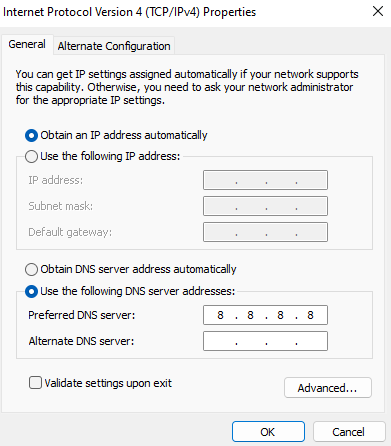

# OAuth Cloud Native Deployment

The second half of a **Kubernetes Local Computer Setup**, to enable real world designs and development.\
See also the [Kubernetes Base Setup](https://github.com/gary-archer/kubernetes.base.setup), for notes on the base infrastructure.\
An End-to-End SPA and API code sample is deployed to Kubernetes, with OAuth security and useful logging.

## External URLs

Scripts will spin up a number of components for the Final SPA, and these URLs will be callable from browsers.\
The ingress controller receives HTTPS requests for multiple host names and routes to the appropriate services.

| Component | URL |
| --------- | --- |
| APIs | https://api.mycluster.com |
| Token Handler | https://tokenhandler.mycluster.com |
| Web Host | https://web.mycluster.com |
| Elasticsearch Logs | https://logs.mycluster.com |
| Kubernetes Dashboard | https://dashboard.mycluster.com |

## Prerequisites

Install these tools:

- A Docker Engine such as [Docker Desktop](https://www.docker.com/products/docker-desktop)
- [Kubernetes in Docker (KIND)](https://kind.sigs.k8s.io/docs/user/quick-start/)
- [Helm](https://helm.sh/docs/intro/install/)
- [openssl](https://www.openssl.org/)

When using a Windows host I also needed to ensure that Google's DNS server was configured against the internet connection.\
This prevents problems resolving AWS URLs from inside the cluster once the installation is complete.



## Deploy the System

First create the cluster's base infrastructure:

```bash
./1-create-cluster.sh
```

Then build apps into Docker containers:

```bash
./2-build.sh
```

Then deploy apps to the Kubernetes cluster:

```bash
./3-deploy.sh
```

Optionally deploy Elastic Stack components in order to use end-to-end API logging:

```bash
./4-deploy-elasticstack.sh
```

Later you can free all resources when required via this script:

```bash
./5-teardown.sh
```

## Enable Development URLs

Look for this line in logs after step 1 above.\
This will be the loopack URL on macOS and Windows, or a load balancer assigned IP address on Linux:

```text
The cluster's external IP address is 127.0.0.1 ...
```

Add it to the hosts file on the local computer, mapped to these external URLs:

```text
127.0.0.1 web.mycluster.com api.mycluster.com tokenhandler.mycluster.com logs.mycluster.com dashboard.mycluster.com
```

Then trust the root certificate at `certs/mycluster.ca.pem` on the local computer.\
This is done by adding it to the host's certificate store as explained in [Configuring SSL Trust](https://authguidance.com/developer-ssl-setup#os-ssl-trust).

## Use the System

Then sign in to the Single Page Application with these details:

| Field | Value |
| ----- | ----- |
| SPA URL | https://web.mycluster.com/spa |
| User Name | guestuser@mycluster.com |
| User Password | GuestPassword1 |

To [Query API Logs](https://authguidance.com/2019/08/02/intelligent-api-platform-analysis/), sign into Kibana with these details:

| Field | Value |
| ---------- | ----- |
| Kibana URL | https://logs.mycluster.com/app/dev_tools#/console |
| User Name | elastic |
| User Password | Password1 |

## View Kubernetes Resources

The deployment provides multiple worker nodes for hosting applications:

```text
kubectl get nodes -o wide

NAME                  STATUS   ROLES                  AGE   VERSION   INTERNAL-IP
oauth-control-plane   Ready    control-plane,master   15m   v1.24.0   172.29.0.4
oauth-worker          Ready    <none>                 15m   v1.24.0   172.29.0.2
oauth-worker2         Ready    <none>                 15m   v1.24.0   172.29.0.3
```

The worker nodes host application containers within a `deployed` namespace:

```text
kubectl get pods -o wide -n deployed

NAME                           READY   STATUS    RESTARTS   AGE   IP           NODE
finalapi-77b44bf64-gh646       1/1     Running   0          86s   10.244.1.6   oauth-worker
finalapi-77b44bf64-kqnql       1/1     Running   0          86s   10.244.2.7   oauth-worker2
network-multitool-9zmcx        1/1     Running   0          13m   10.244.2.3   oauth-worker2
network-multitool-mf5mn        1/1     Running   0          13m   10.244.1.3   oauth-worker
oauthagent-9fc86d5cc-lhqrs     1/1     Running   0          84s   10.244.1.7   oauth-worker
oauthagent-9fc86d5cc-s8wws     1/1     Running   0          84s   10.244.2.8   oauth-worker2
webhost-5f76fdcf46-lwsdb       1/1     Running   0          87s   10.244.2.6   oauth-worker2
webhost-5f76fdcf46-zsxr9       1/1     Running   0          87s   10.244.1.5   oauth-worker
```

The worker nodes also host Elastic Stack containers within an `elasticstack` namespace:

```text
kubectl get pods -o wide -n elasticstack

NAME                             READY   STATUS              RESTARTS   AGE     IP            NODE
elasticsearch-67f7d45c6f-khbmp   1/1     Running             0          2m43s   10.244.2.16   oauth-worker
es-initdata-job-lbnqv            0/1     Completed           0          2m42s   10.244.1.12   oauth-worker2
filebeat-q5xw8                   1/1     Running             0          2m41s   172.29.0.2    oauth-worker
filebeat-skwbs                   1/1     Running             0          2m41s   172.29.0.3    oauth-worker2
kibana-67fb658898-t2jdb          1/1     Running             0          2m42s   10.244.2.17   oauth-worker
```
