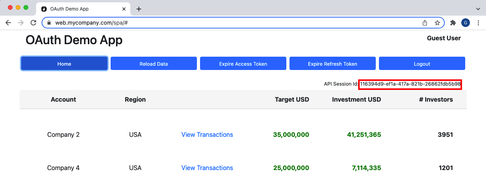
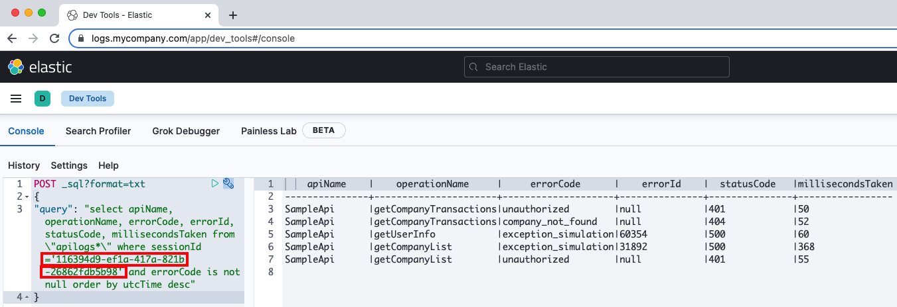

# Cloud Native Deployment

Resources for deploying an End-to-End SPA and API code sample to Kubernetes on a development computer.\
The goal is to enable portable code running in a portable deployment setup and with the best capabilities.

## External URLs

Scripts will spin up a number of components for the Final SPA, and these external URLs will be used:

| Component | External URL | Description |
| --------- | ------------ | ----------- |
| Web Host | https://web.mycompany.com/spa | A development host to serve web static content for the SPA |
| Reverse Proxy | https://api.mycompany.com | The base URL for the reverse proxy that sits in front of APIs |
| Token Handler | https://api.mycompany.com/tokenhandler | The SPA calls the token handler via the reverse proxy to perform OAuth work |
| Business API | https://api.mycompany.com/api | The SPA calls the business API via the reverse proxy to get data |
| Log Query UI | https://logs.mycompany.com/app/dev_tools#/console | The Kibana UI used to analyze technical support logs |

## Prerequisites

- Install [Docker Desktop](https://www.docker.com/products/docker-desktop) and [Kubernetes in Docker](https://kind.sigs.k8s.io/docs/user/quick-start/)
- Configure the Docker Engine to use 16GB of RAM and 4 CPUs
- Also ensure that the `openssl`, `curl` and `jq` tools are installed
- Scripts should be run from either a macOS terminal or from a Windows Git Bash shell

## Deploy the System

First create the cluster:

```bash
./1-create-cluster.sh
```

Then create external SSL certificates and set up a Private PKI for inside the cluster:

```bash
./2-create-certs.sh
```

Then build apps into Docker containers:

```bash
./3-build.sh
```

Then deploy apps to the Kubernetes cluster:

```bash
./4-deploy.sh
```

Optionally deploy Elastic Stack components in order to use end-to-end API logging:

```bash
./5-deploy-elasticstack.sh
```

Later you can free all resources when required via this script:

```bash
./6-teardown.sh
```

## Enable Development URLs

Update the hosts file with these development domain names:

```text
127.0.0.1 localhost web.mycompany.com api.mycompany.com logs.mycompany.com
:1        localhost
```

Then trust the root certificate authority at `certs\mycompany.ca.pem` on the local computer.\
This is done by adding it to the macOS system keychain or Windows local computer certificate store.

On Linux, how this is done depends on your distro, and its age. First, copy the above certificate to one of the following directories, changing its extension to `.crt` as you do it. For RHEL, this includes compatibles such as Fedora, CentOS and Amazon Linux


| Distro | Directory|
|--------|----------|
| RHEL  < 7 | `/usr/local/share/ca-certificates` |
| RHEL >= 7 | `/etc/pki/ca-trust/source/anchors` |
| Debian/Ubuntu | `/usr/local/share/ca-certificates` |

You will then need to use your package manager to install the `ca-certificates` package, and execute the following as root to install the cert:

* RHEL - `update-ca-trust`
* Debian - `update-ca-certificates`

## Use the System

Then sign in to the Single Page Application with these details:

| Field | Value |
| ----- | ----- |
| SPA URL | https://web.mycompany.com/spa |
| User Name | guestuser@mycompany.com |
| User Password | GuestPassword1 |



Also sign into Kibana with these details, and run queries from the [Technical Support Analysis](https://authguidance.com/2019/08/02/intelligent-api-platform-analysis/) blog post:

| Field | Value |
| ---------- | ----- |
| Kibana URL | https://logs.mycompany.com/app/dev_tools#/console |
| User Name | elastic |
| User Password | Password1 |



## View Kubernetes Resources

The deployment aims for a real world setup for a development computer, with multiple worker nodes:

```text
kubectl get nodes:

NAME                  STATUS   ROLES                  AGE   VERSION
oauth-control-plane   Ready    control-plane,master   15m   v1.21.1
oauth-worker          Ready    <none>                 15m   v1.21.1
oauth-worker2         Ready    <none>                 15m   v1.21.1
```

View the installed networking components in the `kube-system` namespace:

```text
kubectl get pods -o wide -n kube-system

calico-kube-controllers-958545d87-2rxkl       1/1     Running   0          11m   10.244.185.66   oauth-worker2
calico-node-5xfmp                             1/1     Running   0          11m   172.29.0.3      oauth-worker
calico-node-bh9cv                             1/1     Running   0          11m   172.29.0.4      oauth-worker2
calico-node-rs6v4                             1/1     Running   0          11m   172.29.0.2      oauth-control-plane
coredns-558bd4d5db-9lsdb                      1/1     Running   0          11m   10.244.161.66   oauth-worker
coredns-558bd4d5db-dvjjj                      1/1     Running   0          11m   10.244.185.67   oauth-worker2
etcd-oauth-control-plane                      1/1     Running   0          11m   172.29.0.2      oauth-control-plane
kube-apiserver-oauth-control-plane            1/1     Running   0          11m   172.29.0.2      oauth-control-plane
kube-controller-manager-oauth-control-plane   1/1     Running   1          11m   172.29.0.2      oauth-control-plane
kube-proxy-22gkp                              1/1     Running   0          11m   172.29.0.2      oauth-control-plane
kube-proxy-g8qht                              1/1     Running   0          11m   172.29.0.3      oauth-worker
kube-proxy-xv2nw                              1/1     Running   0          11m   172.29.0.4      oauth-worker2
kube-scheduler-oauth-control-plane            1/1     Running   1          11m   172.29.0.2      oauth-control-plane
```

Each worker node hosts application containers within a `deployed` namespace:

```text
kubectl get pods -o wide -n deployed

NAME                           READY   STATUS    RESTARTS   AGE   IP           NODE
finalapi-77b44bf64-gh646       1/1     Running   0          86s   10.244.1.6   oauth-worker
finalapi-77b44bf64-kqnql       1/1     Running   0          86s   10.244.2.7   oauth-worker2
kong-proxy-57d5fcd47f-6blc4    1/1     Running   0          83s   10.244.1.8   oauth-worker
network-multitool-9zmcx        1/1     Running   0          13m   10.244.2.3   oauth-worker2
network-multitool-mf5mn        1/1     Running   0          13m   10.244.1.3   oauth-worker
tokenhandler-9fc86d5cc-lhqrs   1/1     Running   0          84s   10.244.1.7   oauth-worker
tokenhandler-9fc86d5cc-s8wws   1/1     Running   0          84s   10.244.2.8   oauth-worker2
webhost-5f76fdcf46-lwsdb       1/1     Running   0          87s   10.244.2.6   oauth-worker2
webhost-5f76fdcf46-zsxr9       1/1     Running   0          87s   10.244.1.5   oauth-worker
```

Each worker node also hosts Elastic Stack containers within an `elasticstack` namespace:

```text
kubectl get pods -o wide -n elasticstack

NAME                             READY   STATUS              RESTARTS   AGE     IP            NODE
elasticsearch-67f7d45c6f-khbmp   1/1     Running             0          2m43s   10.244.2.16   oauth-worker
es-initdata-job-lbnqv            0/1     Completed           0          2m42s   10.244.1.12   oauth-worker2
filebeat-q5xw8                   1/1     Running             0          2m41s   172.29.0.2    oauth-worker
filebeat-skwbs                   1/1     Running             0          2m41s   172.29.0.3    oauth-worker2
kibana-67fb658898-t2jdb          1/1     Running             0          2m42s   10.244.2.17   oauth-worker
```
